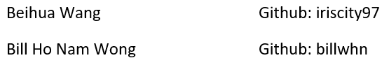
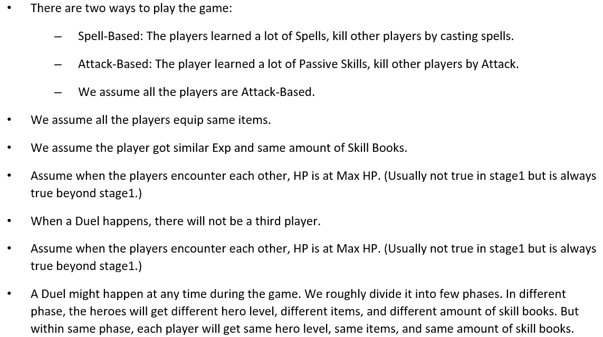

# Monte Carlo Simulation of a Duel in Game Background
#### Game: Battle or Mirkwood (Based on Dota2 Engine)
#### 2022 Spring Final Project
*Note: The data is up to 05/05/2022, some changes may occur since Dota2 is always updating.
## Team Members

## Game Introduction
This is a simulation of a duel in a game background.
Battle Of Mirkwood is a Role Play Game based on Dota2. Hundreds of neutral creatures wander throughout the whole map. The neutral creatures will grant hero Skill Books which can be consumed to learn a new skill or improve the skill level by one level for each Skill Book consumed.
Players will encounter each other; this is where the duel happens. The duel might happen throughout the game, and the player who achieves 80 Player Kills first wins the game.
## Basic Conceptions
### Heroes
Each hero has different attributes: Damage, Attack Speed, Hit Point (HP), Armor and so on. Details see Appendix. 
Since there are too many models in the game which will unnecessarily complicate the simulation, we will set the model to Monkey King.
### Skills
Since spells are too complicated to simulate, we only consider passive skills. Each hero can learn 2 main passive skills and 4 sub passive skills.
#### Main Skills
The max level for a main skill is 4, the skill level cannot exceed (1+hero’s level) / 2.
The level of main skills grow as the level of the hero grows.
In the simulation, it is totally randomly selected.
#### Sub Skills
The max level for a sub skill is 10, the skill level cannot exceed the hero’s level.
Killing the neutral creatures will grant hero Skill Books. Each Skill Book is bounded to a specific Sub Skill. Consuming a Skill Book can grant hero that Sub Skill. If the hero has already learned that Sub Skill, each Skill Book consumed will improve one skill level of that Sub Skill.
For example, if a hero consumed 7 Skill Book-Armor Improving, he will have a Level 7 Sub Skill Armor Improving.
### Items
There are various items in the game, which makes it impossible to simulate. Thus, we will simulate the duel only with two items: Monkey King Bar and Heart of Tarrasque.
##### *Item - Monkey King Bar:
Damage + 40, Attack Speed + 45. Grants each attack an 80% chance to pierce through evasion and deal 70 bonus magical damage.

(Source: https://liquipedia.net/dota2/Monkey_King_Bar)
##### *Item - Heart of Tarrasque:
Strength + 45, Health+ 250, Health Regen+ 1.6% Max Health Regen

(Source: https://liquipedia.net/dota2/Heart_of_Tarrasque)
## Basic Assumptions
