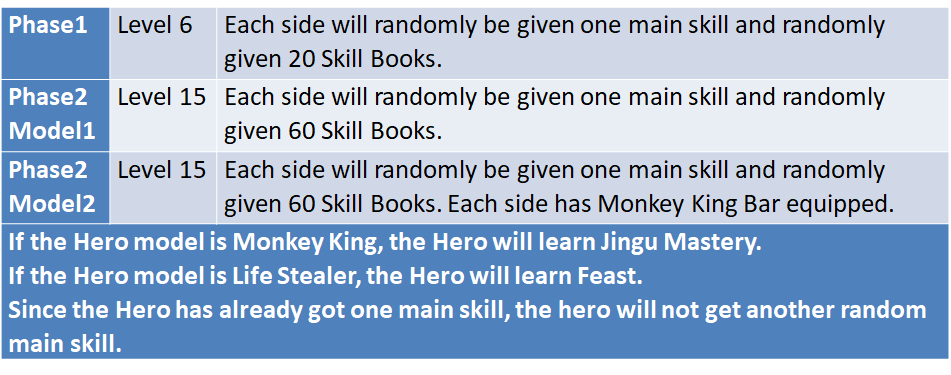

# Monte Carlo Simulation of a Duel in Game Background
#### Game: Battle or Mirkwood (Based on Dota2 Engine)
#### 2022 Spring Final Project of IS597 PR*

*Note: The data is up to 05/05/2022, some changes may occur since Dota2 is always updating.
## Team Members

## Game Introduction
This is a simulation of a duel in a game background.
Battle Of Mirkwood is a Role Play Game based on Dota2. Hundreds of neutral creatures wander throughout the whole map. The neutral creatures will grant hero Skill Books which can be consumed to learn a new skill or improve the skill level by one level for each Skill Book consumed.
Players will encounter each other; this is where the duel happens. The duel might happen throughout the game, and the player who achieves 80 Player Kills first wins the game.
## Basic Conceptions
### Heroes
Each hero has different attributes: Damage, Attack Speed, Hit Point (HP), Armor and so on. Details see Appendix. 
Since there are too many models in the game which will unnecessarily complicate the simulation, we will set the model to Monkey King.
### Skills
Since spells are too complicated to simulate, we only consider passive skills. Each hero can learn 2 main passive skills and 4 sub passive skills.
#### Main Skills
The max level for a main skill is 4, the skill level cannot exceed (1+hero’s level) / 2.
The level of main skills grow as the level of the hero grows.
In the simulation, it is totally randomly selected.
#### Sub Skills
The max level for a sub skill is 10, the skill level cannot exceed the hero’s level.
Killing the neutral creatures will grant hero Skill Books. Each Skill Book is bounded to a specific Sub Skill. Consuming a Skill Book can grant hero that Sub Skill. If the hero has already learned that Sub Skill, each Skill Book consumed will improve one skill level of that Sub Skill.
For example, if a hero consumed 7 Skill Book-Armor Improving, he will have a Level 7 Sub Skill Armor Improving.
### Items
There are various items in the game, which makes it impossible to simulate. Thus, we will simulate the duel only selected items, includes: Monkey King Bar, Heart of Tarrasque and so on.

## Basic Assumptions

## Variables
### Fixed Variables
Hero models & items ---
The attributes for each hero model and each item are set by Dota2.

Skill Effects ---
The effect of each skill is set according to the RPG game as shown on last slide.
### Controlled Variables
Items ---
The hero will equip what set of items.

Hero Model and Hero Level --- 
Which hero model the simulation will actually use and the hero level are manually set.

Amount of Skill Books ---
How many amount of skill books the Hero will get is manually set.
### Variables with Randomness

## Hypotheses
We have four main hypotheses:
### 1. Evasion is the strongest sub skill
### 2. If heroes equip the item "MKB", the winning rate of Evasion will decrease greatly
### 3. Duel at different stages, the weight of sub skills will vary
### 4. Duel at different stages, the weight of main skills will vary
We believe the Evasion is the best sub skill, and the Monkey king bar has an eighty percent chance to pierce through Evasion, so it will make the wining rate of Evasion decrease greatly. Third, in an earlier stage, heroes have less hit point, the duel will have fewer attack rounds and time, so the importance of different sub skills will change. Last, the importance of different main skills will also change because of the hero attributes growth in different stages.
### Hypotheses 1 & 2
To easier test hypotheses 1&2, we controlled the two hero models both monkey king and learned 60 skill books, the upper screenshot shows the duel result of the two heroes without MKB,
The lower one shows the result with MKB, when we calculate the winning rate, we removed the record that both two heroes learn the skill.
Without monkey king bar:

With monkey king bar:

Then we compare the winning rate in a bar chart:

From the blue bar we can see, if a hero does not equip the MKB, the evasion is the strongest sub skill. And there is a huge difference when the hero equips the MKB, this can prove both two hypotheses are correct. And we can also know, when heroes can’t evade damage, the skills "attribute bonus" and "damage bonus" become more important.

# Appendix
## Illustration for More Detailed Game Mechanism
### Armor
Reduce physical damage the hero takes.

(Source: https://liquipedia.net/dota2/Armor)
### Magic Resistance
Reduces Magical damage the hero takes.

All the heroes have a 25% basic Magic Resistance. Since the item system is limited, there is no way to improve magic resistance in this model.

(Source: https://liquipedia.net/dota2/Magic_Resistance)
### Strength & Agility
Strength increases maximum health and health regeneration while Agility increases armor and attack speed. If Strength or Agility is the main attribute (primary attribute), it will also increase damage.

Each Strength gives: +20 Health (Hit Points), +0.1 Health Regeneration

Each Agility gives: +0.16 Armor, +1 Attack Speed
### Attack Speed
Attack Interval = Base Attack Time ÷ (1 + (Increased Attack Speed ÷ 100))

(Source: https://liquipedia.net/dota2/Attack_Speed)
### Damage Type
Physical Damage: Will be compromised by Physical Resistance, related to Armor.

Magic Damage: WIll be compromised by Magic Resistance

True Damage: Will not be compromised by anything.
## Illustration for sub-Skills
Sub-skills are the skills gained by consuming Skill Books. These skills are defined by the RPG game, not Dota2 itself.

## Main SKills
Main Skills are set by Dota2. The main skills implemented includes:
### Jingu Mastery 
This is a skill of Monkey King in Dota2 (https://liquipedia.net/dota2/Monkey_King).

- Upon the fourth hit on the same enemy hero, Monkey King earns four charged attacks that have bonus damage and life steal.

### Other Main Skills Implemented
Feast (Skill of Life Stealer in Dota2 https://liquipedia.net/dota2/Lifestealer)

Moment of Courage (Skill of Legion Commander in Dota2 https://liquipedia.net/dota2/Legion_Commander)

Coup De Grace (Skill of Phantom Assassin in Dota2 https://liquipedia.net/dota2/Phantom_Assassin)

Grow (Skill of Tiny in Dota2 https://liquipedia.net/dota2/Tiny)
## Hero Models
### Monkey King

(Source: https://liquipedia.net/dota2/Monkey_King)
### Other Hero Models Implemented
Life Stealer (https://liquipedia.net/dota2/Lifestealer)

Bounty Hunter (https://liquipedia.net/dota2/Bounty_Hunter)

Treant Protector (https://liquipedia.net/dota2/Treant_Protector)
## Items
### Monkey King Bar:
Damage + 40, Attack Speed + 45. Grants each attack an 80% chance to pierce through evasion and deal 70 bonus magical damage.

(Source: https://liquipedia.net/dota2/Monkey_King_Bar)
### Heart of Tarrasque:
Strength + 45, Health+ 250, Health Regen+ 1.6% Max Health Regen

(Source: https://liquipedia.net/dota2/Heart_of_Tarrasque)
### Satanic:
Strength + 25, Damage + 45, Life Steal + 25%

(Source: https://liquipedia.net/dota2/Satanic)